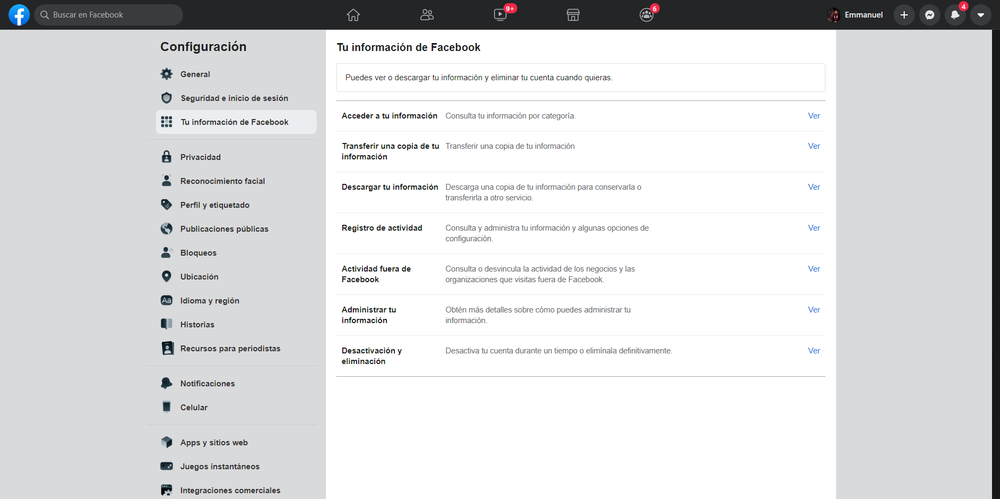
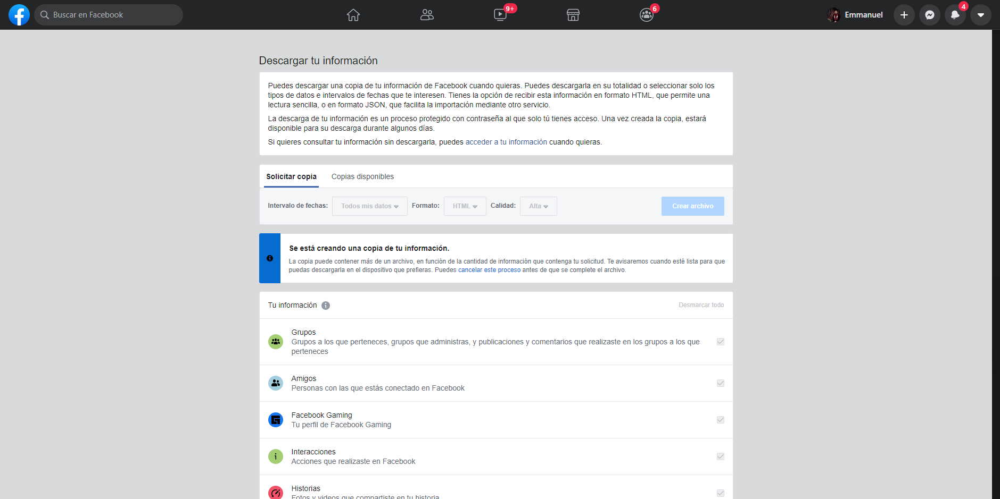
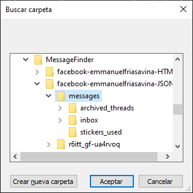
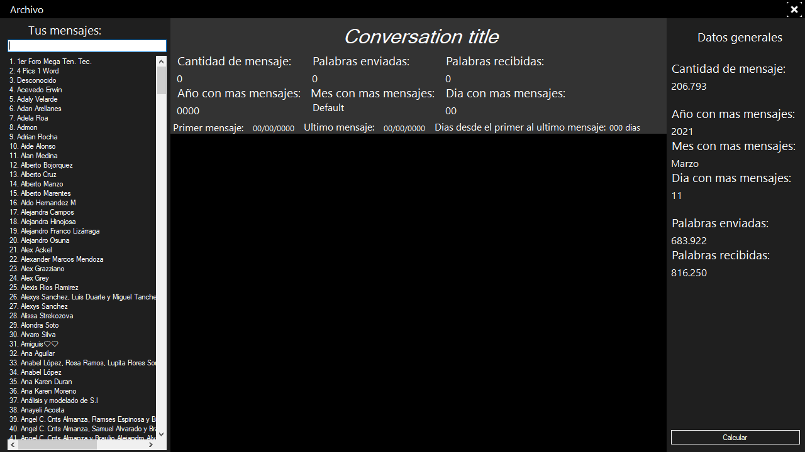

# Messages Finder

Programa escrito en c# para analizar y ver tus mensajes de Facebook Messenger a partir de la copia de la información que te permite descargar Facebook

## Comenzando 🚀

*Estas instrucciones te permitirán obtener una copia del proyecto en funcionamiento en tu máquina local para propósitos de desarrollo y pruebas.*

### Pre-requisitos 📋

Lo primero que ocuparas sera descargar tu informacion de faccebook, mas especificamente necesitaras los mensajes. Si no sabes hacerlo sigue mis instrucciones o siguie las instrucciones de facebook: [¿Cómo descargo una copia de mi información en Facebook?](https://www.facebook.com/help/212802592074644)

Ve a la pestaña de __"Configuracion"__ en tu cuenta de facebook y selecciona __"Tu información de Facebook"__ y posteriormente __"Descargar tu información"__.

Selecciona el formato JSON, desmarca todas las opciones y solo selecciona __"Mensajes"__  que se encuentra mas abajo entre todas las casillas.

## ¿Como usar el programa?

Una vez que tengas la información descargada descomprime la carpeta e iniciar el programa, selecciona el botón archivo en la parte superior, ve a la carpeta donde hallas descomprimido los archivos y entra ve a ***messages*** y selecciona ***inbox***. Una vez que halla cargado todo selecciona la conversación que quieras en el panel de la izquierda y listo.

## Interfaz

